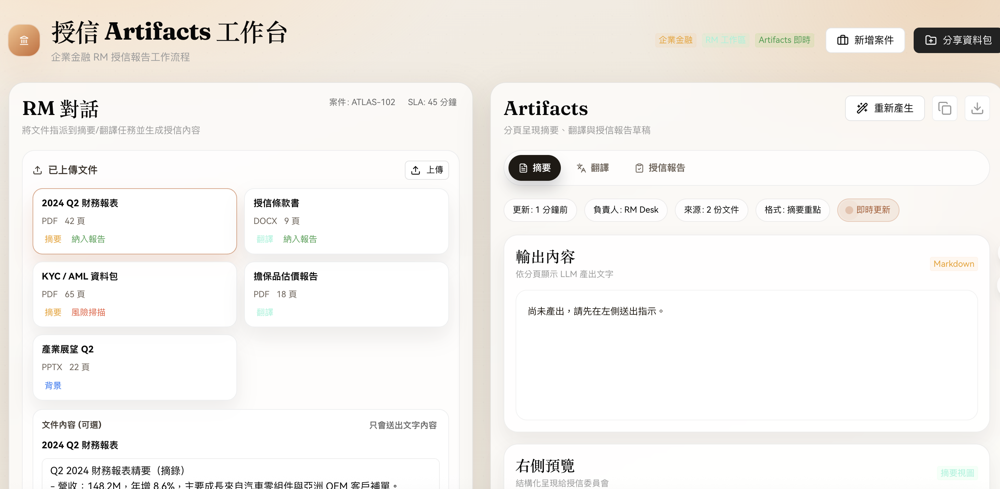

# LobeChat Claude Artifacts Screen

以 LobeHub UI 建立的企業金融 RM 授信原型，模擬指派摘要/翻譯並將產出整理成 Artifacts 分頁，後端改為 Agno（Python Agent）調用。

## 特色
- Claude Artifacts 風格：暖色編輯系雙欄，左側對話/路由，右側輸出 + Live Preview。
- 真實串接：送出指令會打 OpenAI，回填摘要/翻譯/授信報告分頁與任務路由。
- Markdown 預覽：右側 Live Preview 直接渲染模型輸出的 Markdown，預設不填示意值，送出指令後才生成。
- Agent Team + RAG：對話直接溝通 Team，指派 RAG Agent 解析 PDF 並檢索相關段落。
- 文件工作流：可上傳 PDF/TXT，指派摘要/翻譯，生成授信草稿。
- Trace 面板：任務路由內可即時查看 Reasoning / Tool / Content 事件流。

## 快速開始
1. 建立 `.env`（參考 `.env.example`）
   ```bash
   OPENAI_API_KEY=your_api_key_here
   OPENAI_MODEL=gpt-4o-mini
   PORT=8787
   VITE_API_URL=http://localhost:8787
   ```
   使用 `npm run dev` 時可省略 `VITE_API_URL`（前端會走 proxy）。
2. 建立 Python venv 並安裝 Agno 服務端依賴
   ```bash
   python3 -m venv .venv
   . .venv/bin/activate
   pip install -r server/requirements.txt
   ```
3. 安裝前端依賴
   ```bash
   npm install
   ```
4. 啟動 API（Agno + OpenAI 模型）
   ```bash
   npm run dev:api
   ```
5. 另開終端啟動前端
   ```bash
   npm run dev -- --host 127.0.0.1 --port 5176 --strictPort --force --clearScreen false
   ```
6. 打開 `http://127.0.0.1:5176/` 測試。

備註：PDF 會自動索引並可 RAG 檢索；DOCX/PPTX 尚未支援解析，需手動貼上文字內容。

## Trace / Streaming Events
後端 `POST /api/artifacts` 會以 SSE 串流傳回：
- `{"chunk": "..."}`：逐段輸出文字
- `{"routing_update": {...}}`：任務路由更新
- `{"trace_event": {...}}`：Reasoning / Tool / Content / Status / Error
- `{"done": true}`：完成

`trace_event` 格式（節錄）：
```json
{
  "ts": 1730000000,
  "run_id": "run-xxx",
  "session_id": "sess-xxx",
  "agent_name": "Team",
  "type": "reasoning_step | tool_start | tool_done | content | status | error",
  "data": { "text": "...", "tool": "...", "args": "...", "result": "..." }
}
```

可用環境變數：
- `AGNO_STORE_EVENTS=1`：允許 Agno store_events（預設不落盤）
- `AGNO_TRACE_MAX_LEN=2000`：trace 文字截斷長度
- `AGNO_TRACE_ARGS_MAX_LEN=1000`：tool args 截斷長度

## 測試
單元測試：
```bash
python3 -m pytest server/tests/test_trace_events.py
```

整合測試（需 OpenAI 金鑰與支援 reasoning 的模型）：
```bash
RUN_LIVE_AGNO_TESTS=1 OPENAI_API_KEY=... OPENAI_MODEL=gpt-5.2 \
  python3 -m pytest server/tests/test_trace_events.py -m integration
```

## Build / Preview
```bash
npm run build
npm run preview
```

## 截圖
以下為介面截圖（檔案：`授信Artifacts工作台畫面.png`）：



說明：左側為輸入與文件上傳區，右側為模型輸出與 Live Preview，適合用來審閱模型產出、生成授信草稿與匯出報告。
